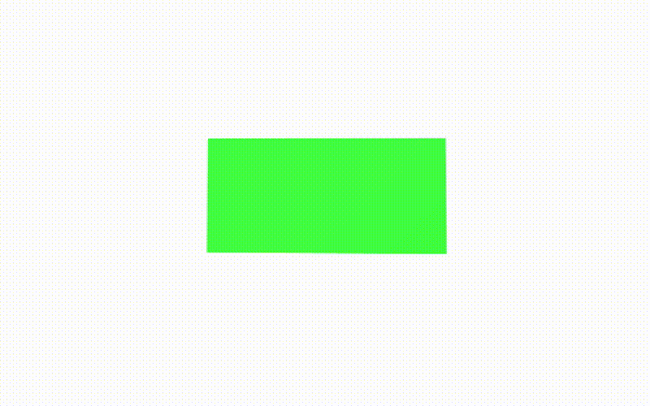

# Part 2 - Create basic scene



### TL;DR

Goals:

- Create basic scene with rotating box.

Steps:

- Create canvas element where we going to attach the `THREE.WebGLRenderer`.
- Create a `THREE.Scene`.
- Create a `THREE.PerspectiveCamera`.
- Create `THREE.AmbientLight` & `THREE.DirectionalLight` and add them to the scene.
- Create `THREE.BoxGeometry` cube and add it to the scene.
- Run a rotating cube animation using `requestAnimationFrame()` loop.

## Create a basic 3D scene

First, we'll create a scene component in the component folder and a `SceneInit` class:

**components/Scene/Scene.vue**

```vue
<template>
  <div ref="container" class="coverdiv"></div>
</template>

<script>
import SceneInit from './js/Scene.init'
export default {
  mounted() {
    this.scene = SceneInit({ rootEl: this.$refs.container })
  },
}
</script>

<style lang="scss" scoped>
body,
html {
  height: 100vh;
  overflow: hidden !important;
}
:focus {
  outline: none;
  border: none;
  -webkit-box-shadow: none;
  box-shadow: none;
}
.coverdiv {
  position: absolute;
  width: 100%;
  height: 100%;
  top: 0;
  left: 0;
}
</style>
```

**components/Scene/js/Scene.init.js**

```js
import * as THREE from 'three'

class SceneInit {
  constructor({ rootEl }) {
    this.canvas = document.createElement('canvas')

    this.root = rootEl
    this.width = rootEl.clientWidth
    this.height = rootEl.clientHeight

    this.background = '#fefefe'

    this.init()
    this.update()
    this.bindEvents()
  }

  init() {
    this.initScene()
    this.initLights()
    this.initCamera()
    this.initRenderer()
    this.buildSceneGeometry()

    this.root.appendChild(this.canvas)
  }

  initScene() {
    this.scene = new THREE.Scene()
    this.scene.background = new THREE.Color(this.background)
    this.scene.fog = new THREE.Fog(this.background, 5, 30)
  }

  initLights() {
    const hlights = new THREE.AmbientLight('#666666')
    const directionalLight = new THREE.DirectionalLight('#dfebff', 1)
    directionalLight.position.set(0, 10, 10)
    directionalLight.position.multiplyScalar(1.3)

    this.scene.add(hlights)
    this.scene.add(directionalLight)
  }

  initCamera() {
    const aspect = this.width / this.height

    this.camera = new THREE.PerspectiveCamera(45, aspect, 0.1, 100)

    this.camera.position.set(0, 4, 5)
  }

  initRenderer() {
    this.renderer = new THREE.WebGLRenderer({ antialias: true })
    this.renderer.setSize(this.width, this.height)
    this.renderer.setClearColor(this.background, 1)

    this.canvas = this.renderer.domElement
  }

  buildSceneGeometry() {
    const geometry = new THREE.BoxGeometry(4, 2, 2)
    const material = new THREE.MeshBasicMaterial({ color: '#00ff00' })
    const cube = new THREE.Mesh(geometry, material)
    this.cube = cube
    this.cube.position.set(0, 2.5, -10)
    this.scene.add(cube)
  }

  render() {
    this.renderer.render(this.scene, this.camera)
  }

  update() {
    requestAnimationFrame(() => this.update())

    this.cube.rotation.x += 0.01
    this.cube.rotation.y += 0.01

    this.render()
  }

  // Callbacks

  onResize = () => {
    this.width = this.root.clientWidth
    this.height = this.root.clientHeight

    this.renderer.setSize(this.width, this.height)

    this.camera.aspect = this.width / this.height
    this.camera.updateProjectionMatrix()
  }

  bindEvents() {
    window.addEventListener('resize', this.onResize)
  }
}

const sceneInit = (args) => new SceneInit(args)

export default sceneInit
```

and add the Scene component to:

**pages/index.vue**

```vue
<template>
  <v-app>
    <v-main>
      <client-only>
        <Scene />
      </client-only>
    </v-main>
  </v-app>
</template>
```

### A look into: components/Scene/Scene.vue

Here, the only thing we do is attach our SceneInit object to the container div & add the apropiate styling so it covers the whole browser window.

```vue
<div ref="container" class="coverdiv"></div>
```

### A look into: components/Scene/js/Scene.init.js

In the constructor, we first create a canvas element where we going to attach the `THREE.WebGLRenderer`. This canvas is going to be appended to the root element. We also initialize other global variables (such as dimensions & background color).

```js
constructor({ rootEl }) {
    this.canvas = document.createElement('canvas')

    this.root = rootEl
    this.width = rootEl.clientWidth
    this.height = rootEl.clientHeight

    this.background = '#fefefe'

    this.init()
    this.update()
    this.bindEvents()
}
```

#### Initialization & Configuration

In the `init()` function we initialize & configure the basic components needed to build our scene.

```js
init() {
    this.initScene()
    this.initLights()
    this.initCamera()
    this.initRenderer()
    this.buildSceneGeometry()

    this.root.appendChild(this.canvas)
}
```

In `initScene()` we create our `THREE.Scene` where we set the background color & a cool fog effect using `THREE.Fog`.

```js
initScene() {
    this.scene = new THREE.Scene()
    this.scene.background = new THREE.Color(this.background)
    this.scene.fog = new THREE.Fog(this.background, 5, 30)
}
```

In `initLights()` we create two types of lights: `THREE.AmbientLight` & `THREE.DirectionalLight`.

```js
initLights() {
    const hlights = new THREE.AmbientLight('#666666')
    const directionalLight = new THREE.DirectionalLight('#dfebff', 1)
    directionalLight.position.set(0, 10, 10)
    directionalLight.position.multiplyScalar(1.3)

    this.scene.add(hlights)
    this.scene.add(directionalLight)
}
```

In `initCamera()` we create a `THREE.PerspectiveCamera`

```js
initCamera() {
    const aspect = this.width / this.height
    this.camera = new THREE.PerspectiveCamera(45, aspect, 0.1, 100)
    this.camera.position.set(0, 4, 5) // Position camera at (0,4,5)
}
```

In `initRenderer()` we initialize the `THREE.WebGLRenderer` and attach it to the canvas.

```js
initRenderer() {
    this.renderer = new THREE.WebGLRenderer({ antialias: true })
    this.renderer.setSize(this.width, this.height)
    this.renderer.setClearColor(this.background, 1)

    this.canvas = this.renderer.domElement
}
```

That's it for the basic initialization & configuration.

#### Add mesh object to scene

Now we are going to add a `THREE.Mesh` object to the scene. A mesh object takes a geometry and a material. We are going to use a `THREE.BoxGeometry` and `THREE.MeshBasicMaterial`.

```js
buildSceneGeometry() {
    const geometry = new THREE.BoxGeometry(4, 2, 2)
    const material = new THREE.MeshBasicMaterial({ color: '#00ff00' })
    const cube = new THREE.Mesh(geometry, material)
    this.cube = cube
    this.cube.position.set(0, 2.5, -10)
    this.scene.add(cube)
}
```

#### Animation loop

We need to call the `render(scene,camera)` method from `THREE.WebGLRenderer`. This method takes what the camera sees from the scene and renders it on the canvas element. Using `requestAnimationFrame()` we will call to render every frame. Also, before rendering, we are going to update our scene. In this case we are changing the rotation of the cube.

```js
render() {
    this.renderer.render(this.scene, this.camera)
}

update() {
    requestAnimationFrame(() => this.update())

    this.cube.rotation.x += 0.01
    this.cube.rotation.y += 0.01

    this.render()
}
```

#### Handle resizing browser window

To handle the resizing of the window is pretty straightforward.

```js
onResize = () => {
    this.width = this.root.clientWidth
    this.height = this.root.clientHeight

    this.renderer.setSize(this.width, this.height)

    this.camera.aspect = this.width / this.height
    this.camera.updateProjectionMatrix()
}

bindEvents() {
    window.addEventListener('resize', this.onResize)
}
```

## Conclusion

Now we have a basic scene with animation. Let's continue to [Part 3 - Let's add controls: OrbitControls](../part-3).
