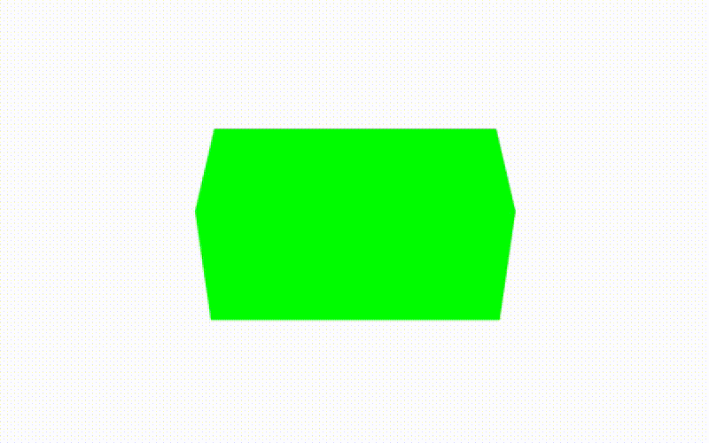

# Part 3 - Let's add controls: OrbitControls



### TL;DR

Goals:

- Orbit & pan around the scene.

Steps:

- Import `OrbitControls` and feed it the camera & renderer.

## Using OrbitControls

First we import `OrbitControls` at the top of **Scene.init.js** file.

```js
import { OrbitControls } from 'three/examples/jsm/controls/OrbitControls.js'
```

and add it on the transpile option in **nuxt.config.js**:

```js
build: {
    transpile: ['OrbitControls.js'],
},
```

In `init()` we will call for the initialization of the `OrbitControls`:

```js
init() {
    this.initScene()
    this.initLights()
    this.initCamera()
    this.initRenderer()
    this.initOrbitControls() // <---
    this.buildSceneGeometry()

    this.root.appendChild(this.canvas)
}
```

Here, in `initOrbitControls()`, we pass the camera & the canvas to `OrbitControls`. It works as it is, but we can change whatever property it has. See more [properties for OrbitControls](https://threejs.org/docs/index.html#examples/en/controls/OrbitControls).

```js
initOrbitControls() {
    this.orbitControls = new OrbitControls(this.camera, this.canvas)

    // Only orbit around north hemisphere
    this.orbitControls.maxPolarAngle = Math.PI * 0.45

    // Dampling/inertia effect
    this.orbitControls.enableDamping = true
    this.orbitControls.dampingFactor = 0.05
    // Pan along 3D plane instead of screen space
    this.orbitControls.screenSpacePanning = false

    this.orbitControls.maxDistance = 15
    this.orbitControls.minDistance = 3

    this.orbitControls.update()
}
```

In the update function, let's get rid of the cube animation and call the `update()` method of `OrbitControls`.

```js
update() {
    requestAnimationFrame(() => this.update())

    this.orbitControls.update()

    this.render()
}
```

Also, let's position the cube at the center so we can orbit around it.

```js
buildSceneGeometry() {
    const geometry = new THREE.BoxGeometry(2, 1, 1)
    const material = new THREE.MeshBasicMaterial({ color: '#00ff00' })
    const cube = new THREE.Mesh(geometry, material)
    this.scene.add(cube)
}
```

## Conclusion

Now we can orbit (left click), pan (right click) & zoom (scroll). Let's continue to [Part 4 - Let's add controls: DragControls](../part-4).
