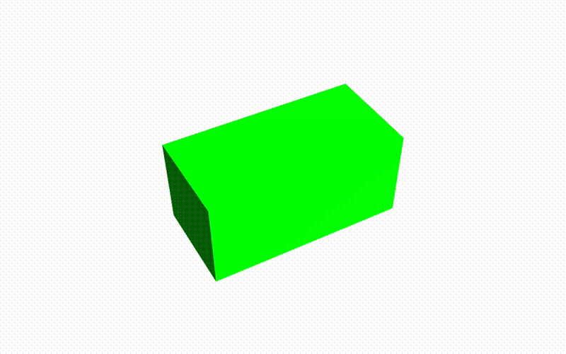

# Part 4 - Let's add controls: DragControls w/custom plane



### TL;DR

Goals:

- Drag & drop object across plane.
- Rotate objects by 90 degrees increments.

Steps:

- Import our custom `DragControls`.

## Using our custom DragControls

Since I want to drag only certain objects & across the scene plane, I modified the `DragControls` to accept our custom plane and the layer of the objects we want to interact with.

You can get the [DragAcrossPlaneControls.js here](../../src/three-lib/DragAcrossPlaneControls.js). We can create & put the file in `/three-lib` folder at the project root.

Now we import `DragAcrossPlaneControls` at the top of **Scene.init.js** file.

```js
import { DragAcrossPlaneControls } from '@/three-lib/DragAcrossPlaneControls.js'
```

In `init()` we will call for the initialization of the `OrbitControls`:

```js
init() {
    this.initScene()
    this.initLights()
    this.initCamera()
    this.initRenderer()
    this.initOrbitControls()
    this.initDragControls() // <---
    this.buildSceneGeometry()

    this.root.appendChild(this.canvas)
}
```

Here, in `initDragControls()`, we create our `DragAcrossPlaneControls`. It needs an array of objects (the ones we want to interact with), the camera, the renderer, the plane (`THREE.Plane` where we want to drag the objects across) & the layer where the objects are. Also we need to disable the orbitControls while we are dragging, so we attach two event listener to enable/disable it.

```js
initDragControls() {
    const plane = new THREE.Plane(new THREE.Vector3(0, 1, 0))
    this.dragControl = new DragAcrossPlaneControls(
      this.objects,
      this.camera,
      this.canvas,
      plane,
      OBJECT_LAYER
    )
    this.dragControl.addEventListener('dragstart', this.onDragStart)
    this.dragControl.addEventListener('dragend', this.onDragEnd)
}

onDragStart = (event) => {
    this.orbitControls.enabled = false
}

onDragEnd = (event) => {
    this.orbitControls.enabled = true
}
```

For the layer, we can chose any number from 0 to 32. The default of all objects is 0. We chose 2 for the objects in this case. Put it below the imports as a global constant.

```js
const OBJECT_LAYER = 2
```

Also we need to initialize an empty array for the objects. Let's put it in the constructor.

```js
constructor({ rootEl }) {
    ...
    this.objects = [] //<---

    this.init()
    this.update()
    this.bindEvents()
}
```

Finally, we need to add an object ot the objects array to interact with. In this case, since we want to lighten the object while it's draged, we create a `THREE.Mesh` with a `THREE.MeshLambertMaterial`. This material offers an emissive property that we are going to use to emit light. Also, we enable the `OBJECT_LAYER` and add the object to a group. The group is for the `DragAcrossPlaneControls`, since the implementation lacks other ways of dealing with objects.

```js
buildSceneGeometry() {
    const geometry = new THREE.BoxGeometry(2, 1, 1)
    const material = new THREE.MeshLambertMaterial({ color: '#00ff00' })
    const cube = new THREE.Mesh(geometry, material)
    cube.layers.enable(OBJECT_LAYER)

    const group = new THREE.Group()
    group.add(cube)

    this.objects.push(group)
    this.scene.add(group)
}
```

In the Drag callbacks, we set the emissive property of the material to light up the object while it's dragged.

```js
onDragStart = (event) => {
  this.orbitControls.enabled = false
  event.object.children[0].material.emissive.set('#444400')
}

onDragEnd = (event) => {
  this.orbitControls.enabled = true
  event.object.children[0].material.emissive.set('#000000')
}
```

## Rotate object while dragging

With the following we can rotate (in this case by increments of 90 degrees) the dragged object with pressing the R keypress.

```js
onDragStart = (event) => {
    ...
    this.selectedDraggableObject = event.object
    document.addEventListener('keydown', this.onKeyDown, false)
}

onDragEnd = (event) => {
    ...
    document.removeEventListener('keydown', this.onKeyDown, false)
    this.selectedDraggableObject = undefined
}

onKeyDown = (event) => {
    // On keypress: 'R'
    if (event.keyCode === 82) {
      this.rotateObject(this.selectedDraggableObject)
    }
}

rotateObject(object) {
    object.rotation.y += Math.PI * 0.5
}
```

## Conclusion

Now we can drag an object across a custom plane & rotate it by 90 degrees. Let's continue to [Part 5 - Instantiate objects with RayCasting](../part-5).
