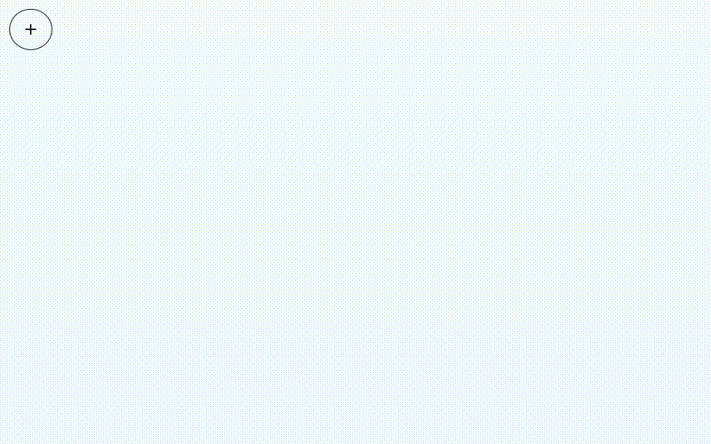

# Part 5 - Instantiate objects with RayCasting



### TL;DR

Goals:

- Instantiate box object over a plane.

Steps:

- Add a plane to the scene.
- Add a marker to point the position where the object will instantiate.
- Initialize a `THREE.Raycaster`.
- Toggle between adding object mode / viewing mode.

## Building the needed geometries

What we want to achive is pointing with a marker over a plane and instantiate an object at that point. For that we need a plane and a marker.

```js
buildSceneGeometry() {
    this.buildPlane()
    this.buildMarker()
}

buildPlane() {
    const planeGeometry = new THREE.PlaneBufferGeometry(150, 150)
    const planeMaterial = new THREE.MeshLambertMaterial({
      color: '#eee',
    })
    this.plane = new THREE.Mesh(planeGeometry, planeMaterial)
    this.plane.rotation.x -= Math.PI * 0.5
    this.scene.add(this.plane)
}

buildMarker() {
    this.marker = new THREE.Object3D()

    const geometryTorus = new THREE.TorusBufferGeometry(0.1, 0.02, 2, 100)
    const materialTorus = new THREE.MeshBasicMaterial({ color: '#5b3cc4' })
    const torus = new THREE.Mesh(geometryTorus, materialTorus)
    torus.rotation.x -= Math.PI * 0.5
    torus.position.y += 0.01
    this.marker.add(torus)

    const geometryCircle = new THREE.CircleBufferGeometry(0.08, 32)
    const materialCircle = new THREE.MeshBasicMaterial({
      color: '#ffffff',
      transparent: true,
      opacity: 0.5,
    })
    const circle = new THREE.Mesh(geometryCircle, materialCircle)
    circle.rotation.x -= Math.PI * 0.5
    circle.position.y += 0.01
    this.marker.add(circle)

    this.scene.add(this.marker)
}
```

## Raycaster

Let's initialize a `THREE.Raycaster`.

```js
init() {
    this.initScene()
    this.initLights()
    this.initCamera()
    this.initRenderer()
    this.initOrbitControls()
    this.initDragControls()
    this.initAddObjectModeRaycaster() //<---
    this.buildSceneGeometry()

    this.root.appendChild(this.canvas)
}
```

```js
initAddObjectModeRaycaster() {
    this.raycaster = new THREE.Raycaster()
    this.mouse = new THREE.Vector2()
}
```

In `bindEvents()`, add a 'mousemove' event listener to get the mouse position from the canvas.

```js
onDocumentMouseMove = (event) => {
    event.preventDefault()
    this.mouse.x = (event.clientX / this.width) * 2 - 1
    this.mouse.y = -(event.clientY / this.height) * 2 + 1
}

bindEvents() {
    window.addEventListener('resize', this.onResize)
    this.canvas.addEventListener('mousemove', this.onDocumentMouseMove, false)
}
```

Since we are going to toggle between add object mode / viewing mode, add an `isAddObjectMode` boolean on the constructor.

```js
constructor({ rootEl }) {
    ...
    this.isAddObjectMode = true

    this.init()
    this.update()
    this.bindEvents()
}
```

In `update()`, we are going etiher point with the raycaster for instantiating an object or dragging the object.

```js
update() {
    requestAnimationFrame(() => this.update())

    this.orbitControls.update()

    if (this.isAddObjectMode) {
      this.planePointer()
      this.dragControl.enabled = false
    } else {
      this.marker.visible = false
      this.dragControl.enabled = true
    }

    this.render()
}
```

In `planePointer()`, we get the intersection point between the ray and the plane. At that point position we make visible the marker.

```js
planePointer() {
    this.raycaster.setFromCamera(this.mouse, this.camera)
    const intersects = this.raycaster.intersectObjects([this.plane], true)
    if (intersects.length > 0) {
      this.marker.visible = true
      this.marker.position.copy(intersects[0].point)
    } else {
      this.marker.visible = false
    }
}
```

## Instantiate object

We create our `instantiateObject()` method that creates a box & moves it to where the marker is.

```js
instantiateObject() {
    if (!this.isAddObjectMode) return

    const geometry = new THREE.BoxGeometry(1, 0.5, 0.5)
    const material = new THREE.MeshLambertMaterial({ color: '#00ff00' })
    const cube = new THREE.Mesh(geometry, material)
    cube.layers.enable(OBJECT_LAYER)
    const object = new THREE.Object3D()
    object.add(cube)

    // Move object where the marker is
    object.position.copy(this.marker.position)
    object.position.y += 0.25

    this.scene.add(object)
    this.objects.push(object)
}
```

We also want a 'mousedown' event listener to trigger the `instantiateObject()` method.

```js
onDocumentMouseDown = (event) => {
    if (event.target.localName === 'canvas' && event.button === 0)
      this.instantiateObject()
}

bindEvents() {
    ...
    this.canvas.addEventListener('mousedown', this.onDocumentMouseDown, false)
}
```

## Toggle button

In **components/Scene/Scene.vue**, we add the toggle button & bind the data with the component.

```vue
<template>
  <div ref="container" class="coverdiv">
    <div class="toggle-button">
      <v-tooltip bottom color="black">
        <template v-slot:activator="{ on }">
          <v-btn
            outlined
            fab
            :color="isAddObjectMode ? 'red' : 'mdi-plus'"
            v-on="on"
            @click="toggleAddObjectMode()"
          >
            <v-icon>{{ isAddObjectMode ? 'mdi-close' : 'mdi-plus' }}</v-icon>
          </v-btn>
        </template>
        <span>Turn {{ isAddObjectMode ? 'off' : 'on' }} add object mode</span>
      </v-tooltip>
    </div>
  </div>
</template>

<script>
import SceneInit from './js/Scene.init'
export default {
  data() {
    return {
      isAddObjectMode: false,
    }
  },
  mounted() {
    this.scene = SceneInit({ rootEl: this.$refs.container })
  },
  methods: {
    toggleAddObjectMode() {
      this.isAddObjectMode = !this.isAddObjectMode
      this.scene.isAddObjectMode = this.isAddObjectMode
    },
  },
}
</script>

<style lang="scss" scoped>
body,
html {
  height: 100vh;
  overflow: hidden !important;
}
:focus {
  outline: none;
  border: none;
  -webkit-box-shadow: none;
  box-shadow: none;
}
.coverdiv {
  position: absolute;
  width: 100%;
  height: 100%;
  top: 0;
  left: 0;
}

.toggle-button {
  position: absolute;
  left: 15px;
  top: 15px;
  overflow: hidden;
}
</style>
```

## Conclusion

Now we can point at the scene and instantiate boxes across the plane. Let's continue to [Part 6 (Final) - Plug & snap objects](../part-6).
