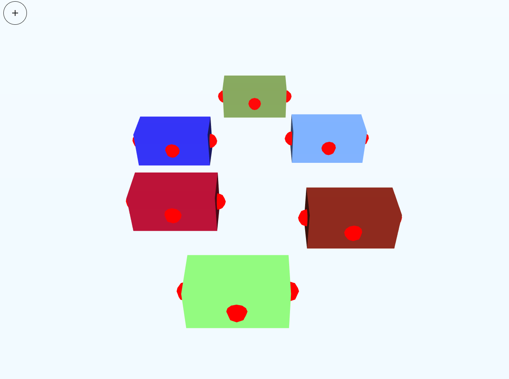

# Part 6 (Final) - Plug & snap objects


### TL;DR

Goals:

- Snapping two boxes through connection points.

Steps:

- Add spheres objects representing connection points
- Snap objects on dragging.

## Add connection points

In `instantiateObject()`, we add all the connection points (in this case we are going to represent those connection points as sphere geometries) to the box object. Also, this time we are going to instantiate boxes with random colors.

```js
instantiateObject() {
    if (!this.isAddObjectMode) return

    const geometry = new THREE.BoxGeometry(1, 0.5, 0.5)
    const material = new THREE.MeshLambertMaterial({
      color: `#${Math.floor(Math.random() * 16777215).toString(16)}`,
    })
    const cube = new THREE.Mesh(geometry, material)
    cube.layers.enable(OBJECT_LAYER)
    const object = new THREE.Object3D()
    object.add(cube)
    object.position.copy(this.marker.position)
    object.position.y += 0.25

    // Generate connecting points
    const connectionPoints = [
      { x: -0.5, y: 0, z: 0 },
      { x: 0.5, y: 0, z: 0 },
      { x: 0, y: 0, z: 0.25 },
    ]
    connectionPoints.forEach((point) => {
      const sphereGeometry = new THREE.SphereBufferGeometry(0.1)
      const sphereMaterial = new THREE.MeshBasicMaterial({ color: '#ff0000' })
      const sphere = new THREE.Mesh(sphereGeometry, sphereMaterial)
      sphere.position.set(point.x, point.y, point.z)
      object.children[0].add(sphere)
    })

    this.scene.add(object)
    this.objects.push(object)
}
```

You can try to run it and you'll see the different color boxes with spheres attached to them.



Now, we want to only show the spheres when we are draggin. To accomplish this, we'll use layers to hide it from the camera visibility. The camera only captures objects in layer 0. Let's move the spheres to layer 3 this time.

```js
const CONN_POINTS_LAYER = 3
```

```js
connectionPoints.forEach((point) => {
  const sphereGeometry = new THREE.SphereBufferGeometry(0.1)
  const sphereMaterial = new THREE.MeshBasicMaterial({ color: '#ff0000' })
  const sphere = new THREE.Mesh(sphereGeometry, sphereMaterial)
  sphere.position.set(point.x, point.y, point.z)

  // Move sphere to layer CONN_POINTS_LAYER
  sphere.layers.set(CONN_POINTS_LAYER)

  object.children[0].add(sphere)
})
```

When dragging we'll have to enable the CONN_POINTS_LAYER for the camera to make the spheres visible. When the dragging ends, we reset the camera to only capture the default layer.

```js
onDragStart = (event) => {
    this.camera.layers.enable(CONN_POINTS_LAYER)
    ...
}

onDragEnd = (event) => {
    this.camera.layers.set(0)
    ...
}
```

## Snap objects

A straight implementation would be to iterate every sphere and calculate the distance between the selected object's spheres. If the distance is close enough, then move the object to connect with the other object.

```js
snapObjects() {
    // Get connection points from the selected object
    const selectedObjectPoints =
        this.selectedDraggableObject.children[0].children.map(
            (connPoint) => connPoint
        )

    // Iterate all object's connection points (filtering the selected object)
    this.objects
      .filter((object) => object.uuid !== this.selectedDraggableObject.uuid)
      .forEach((object) => {
        object.children[0].children.forEach((connPoint) => {
          selectedObjectPoints.forEach((sConnPoint) => {

            // Compare distance in WORLD coords
            const s = new THREE.Vector3()
            const d = new THREE.Vector3()
            connPoint.getWorldPosition(d)
            sConnPoint.getWorldPosition(s)
            if (s.distanceTo(d) < 0.2) {

              // Position difference between connection points in WORLD coords
              // Move object that difference
              const differenceWorld = new THREE.Vector3().subVectors(d, s)
              const objectPosWorld = new THREE.Vector3()
              this.selectedDraggableObject.getWorldPosition(objectPosWorld)
              const moveWorld = new THREE.Vector3().addVectors(
                objectPosWorld,
                differenceWorld
              )
              this.selectedDraggableObject.position.set(
                moveWorld.x,
                moveWorld.y,
                moveWorld.z
              )
            }
          })
        })
      })
}
```

Call `snapObjects()` on 'dragend' event.

```js
onDragEnd = (event) => {
    this.camera.layers.set(0)
    this.snapObjects()
    ...
}
```

## Conclusion

That's all! Now we have a quick proof of concept of a Drag & Snap 3D web app project.
